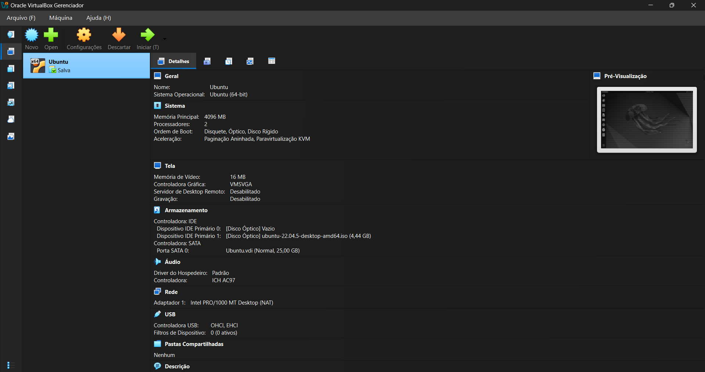
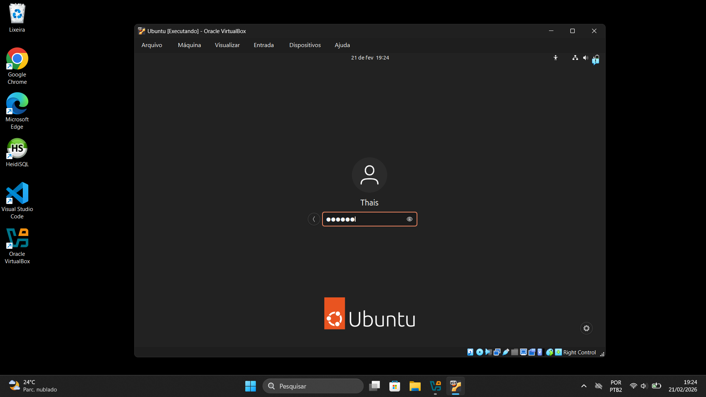

# 🖥️ Semana 1: Instalação e Configuração da Máquina Virtual

Nesta primeira semana, o objetivo foi preparar o ambiente de desenvolvimento local para as práticas da disciplina. O processo envolveu a criação de uma Máquina Virtual (VM) e a instalação do sistema operacional Linux.

## 1. Configuração da Máquina Virtual no VirtualBox
O primeiro passo foi configurar o hardware virtual no Oracle VirtualBox. Como podemos ver na imagem abaixo, a VM foi configurada com o sistema **Ubuntu (64-bit)**, alocando **4096 MB de Memória RAM** (2 processadores) e um disco virtual de **25 GB** para garantir um bom desempenho das ferramentas de dados.

## 2. Instalação e Acesso ao Ubuntu
Após o boot pela imagem ISO (`ubuntu-22.04.5-desktop-amd64.iso`), realizei todo o processo de instalação do sistema operacional, definindo fuso horário, layout do teclado e criando o usuário principal para acesso.

## 3. Atualização do Sistema
Com a máquina virtual operacional e o login efetuado com sucesso, a primeira boa prática executada foi rodar o atualizador de programas do Ubuntu. Isso garante que todos os pacotes do sistema estejam nas versões mais recentes e seguras antes de começarmos a instalar outras ferramentas.

