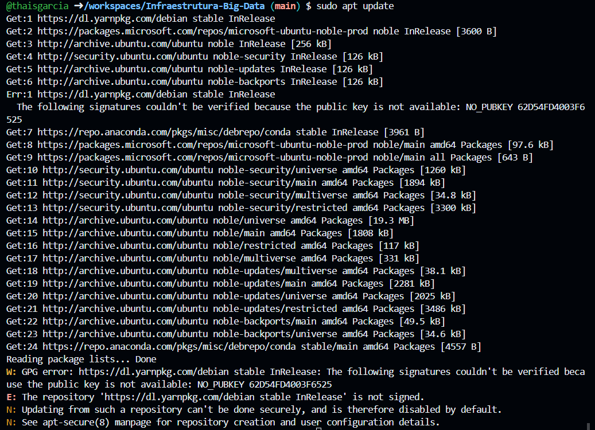
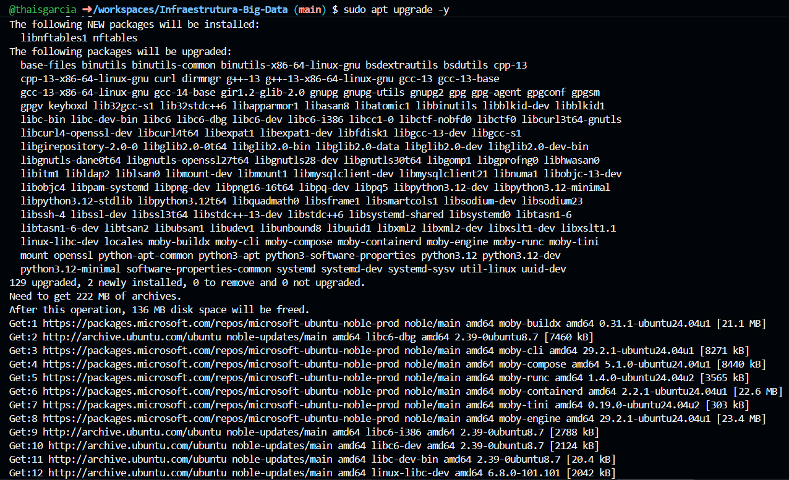
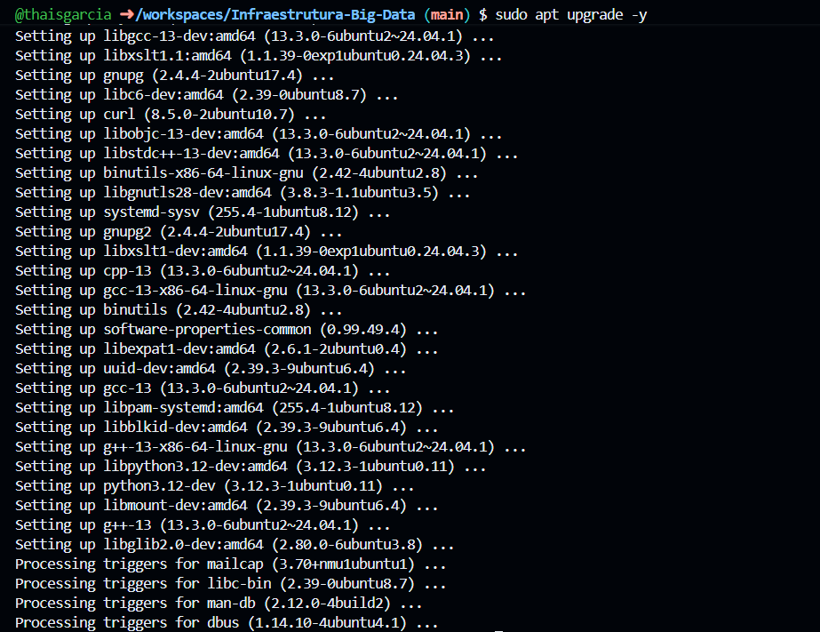
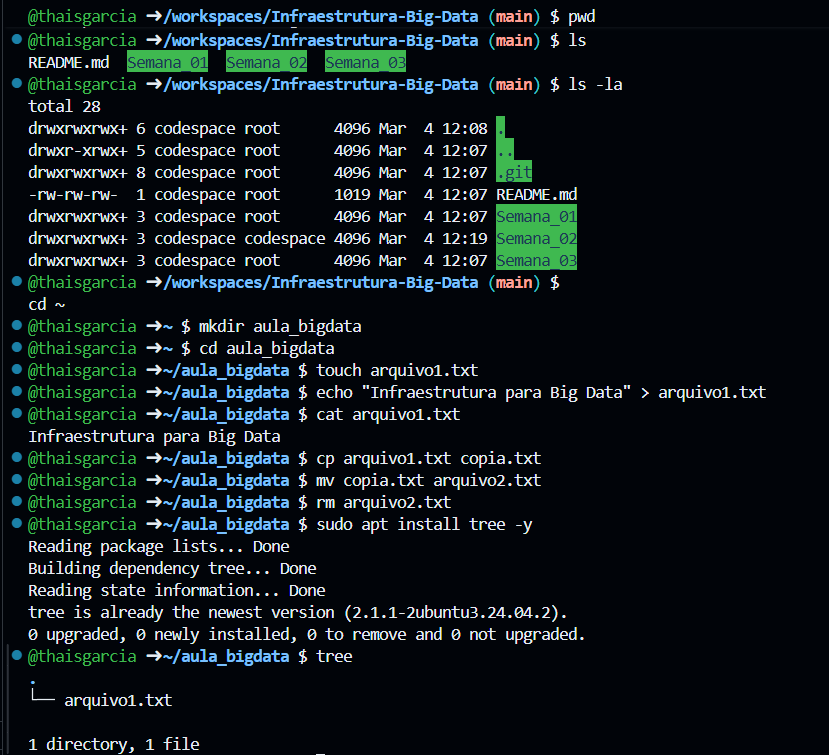
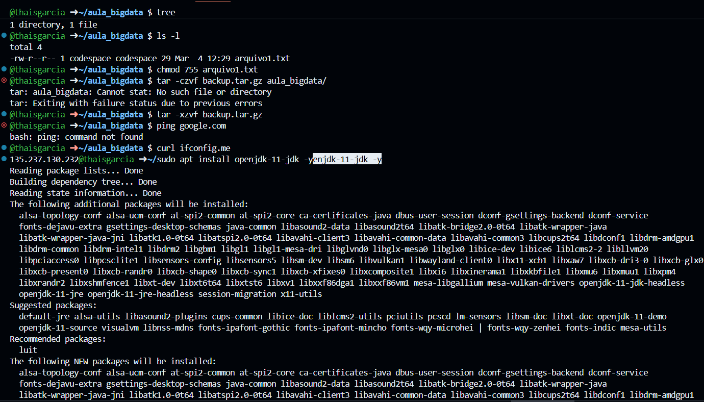
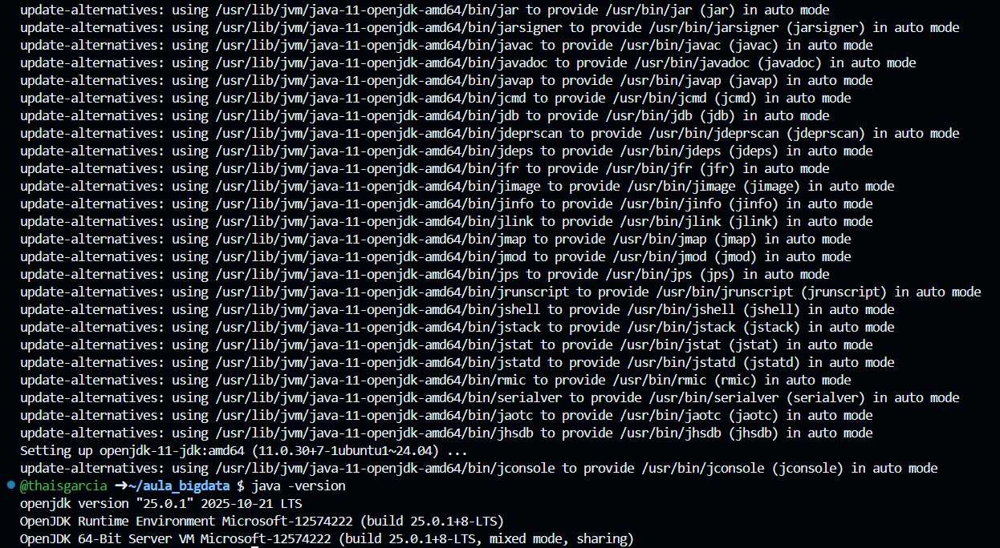

# 🐧 Semana 2: Terminal Linux no GitHub Codespaces

Nesta semana, a atividade teve como foco a familiarização com o terminal Linux através do ambiente GitHub Codespaces. O objetivo foi executar e compreender comandos essenciais de administração de sistemas, preparando a base para a infraestrutura de Big Data.

## 1. Atualização do Sistema
O primeiro passo foi atualizar a lista de pacotes e fazer o upgrade dos programas instalados na máquina virtual do Codespaces.
* `sudo apt update`
* `sudo apt upgrade -y`

## 2. Navegação, Manipulação de Arquivos e Processos
Nesta etapa, exploramos os diretórios, criamos a pasta `aula_bigdata`, manipulamos arquivos de texto e instalamos a ferramenta `tree` para visualização em formato de árvore. 
Comandos utilizados: `pwd`, `ls`, `ls -la`, `cd`, `mkdir`, `touch`, `echo`, `cat`, `cp`, `mv`, `rm` e `tree`.

## 3. Permissões, Compactação e Teste de Rede
Em seguida, alteramos as permissões do arquivo criado, tentamos realizar a compactação da pasta e rodamos testes básicos de rede para descobrir o IP público do ambiente.
* `chmod 755 arquivo1.txt`
* `tar -czvf` e `tar -xzvf`
* `ping google.com` e `curl ifconfig.me`

## 4. Instalação do Java (Pré-Hadoop)
Para preparar o ambiente para ferramentas de Big Data como o Hadoop e Spark, instalamos o Java (JDK) e verificamos a versão ativa no sistema.
* `sudo apt install openjdk-11-jdk -y`
* `java -version`

---

## ⚠️ Dificuldades Encontradas e Aprendizados

Durante a execução da prática, enfrentei alguns cenários reais de uso do terminal que geraram ótimos aprendizados:

1. **Erro na compactação (tar):** Ao executar o comando `tar -czvf backup.tar.gz aula_bigdata/`, o terminal retornou um erro indicando que o arquivo não existia. Analisando o caminho, percebi que isso ocorreu porque eu estava **dentro** da pasta `aula_bigdata` no momento da execução. Para compactar um diretório inteiro, é necessário estar um nível acima dele.

2. **Comando Ping não encontrado:** Ao tentar rodar o `ping google.com`, o sistema retornou `bash: ping: command not found`. Descobri que isso ocorre porque algumas imagens de containers (como a do Codespaces) são super enxutas e não possuem o pacote de rede `iputils-ping` pré-instalado.

3. **Versão do Java:** Embora a instalação tenha solicitado o `openjdk-11-jdk`, ao rodar `java -version`, o sistema retornou a versão 25 da Microsoft. Isso é comum em ambientes gerenciados como o Codespaces, onde configurações nativas do container podem sobrepor ou utilizar versões mais recentes já instaladas.