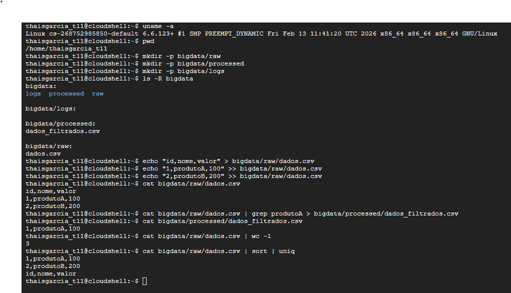
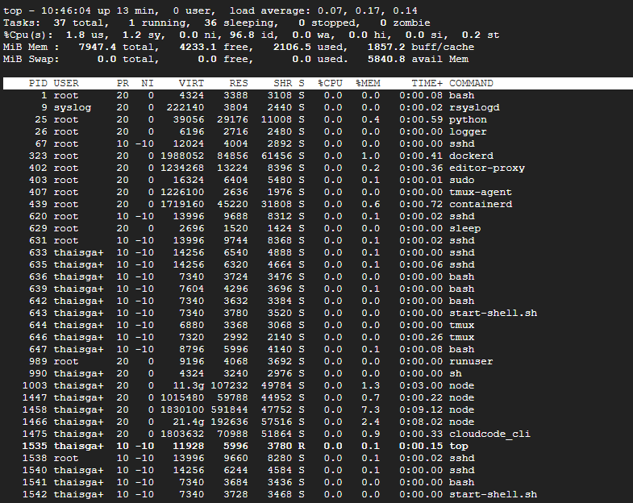
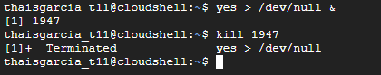
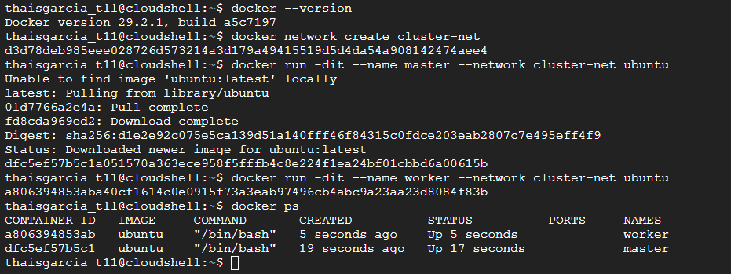
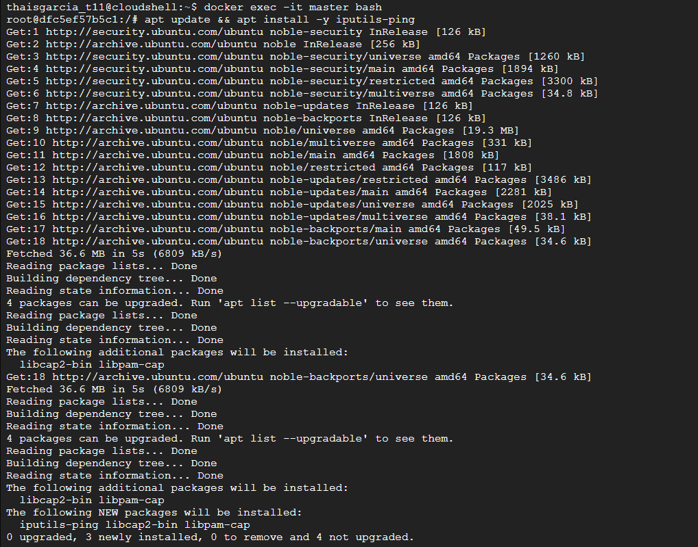
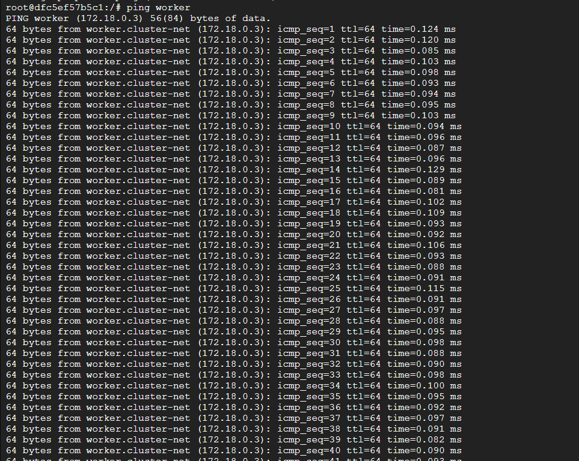
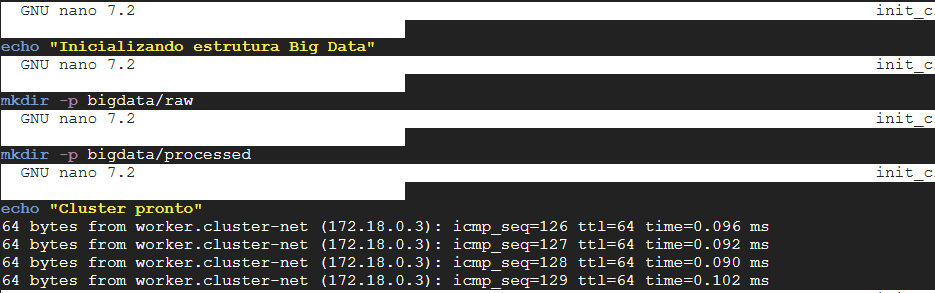
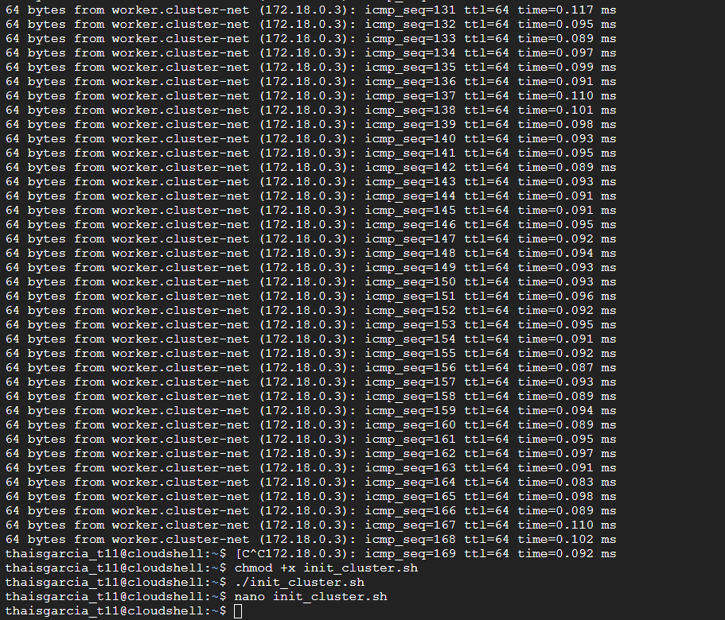

# ☁️ Semana 3: Inicialização de Cluster e Simulação de Big Data no Google Cloud Shell

Nesta terceira semana de atividades, o objetivo foi simular operações fundamentais de um ambiente de Big Data utilizando o Google Cloud Shell. A prática envolveu a criação de uma estrutura de Data Lake local, processamento de dados via terminal, testes de estresse de CPU, orquestração de containers com Docker e automação via Shell Script.

## 🛠️ Etapas Práticas Executadas

### 1. Estruturação do Data Lake e Processamento (MapReduce Simulado)
Primeiro, criamos a infraestrutura básica de diretórios (`raw`, `processed`, `logs`) para simular as camadas de um Data Lake. Em seguida, utilizamos comandos do Linux para simular a ingestão de um arquivo CSV e seu processamento.

> **Comandos executados:** Criação de diretórios com `mkdir -p`, inserção de dados fictícios com `echo`, e processamento em pipeline utilizando `cat`, `grep` (filtragem), `wc -l` (contagem) e `sort | uniq` (ordenação e remoção de duplicatas).

### 2. Monitoramento de Processos e Teste de Carga (Stress Test)
Para entender como processos impactam os recursos da máquina, utilizamos ferramentas de monitoramento e simulamos um gargalo de processamento.

> **Comandos executados:** O comando `top` foi usado para visualizar os processos em tempo real. Depois, rodamos o comando `yes > /dev/null &` em segundo plano para forçar o uso da CPU, seguido pelo comando `kill` usando o PID (1947) para encerrar o processo.

### 3. Criação de Cluster com Docker (Master e Worker)
Para simular um ambiente distribuído (como o Hadoop ou Spark), criamos uma rede interna e instanciamos dois containers Docker separados: um atuando como nó mestre e o outro como trabalhador.

> **Comandos executados:** `docker network create` para isolar a rede, seguido de `docker run` para subir os containers `master` e `worker` baseados na imagem do Ubuntu. Acessamos o bash do master com `docker exec`, instalamos o pacote `iputils-ping` e disparamos um `ping worker` para comprovar a comunicação entre as máquinas do cluster.

### 4. Automação com Shell Script
Para não precisarmos repetir comandos de criação de estrutura manualmente, consolidamos as instruções em um script executável.

> **Comandos executados:** Utilizamos o editor `nano init_cluster.sh` para escrever o script, aplicamos a permissão de execução com `chmod +x` e rodamos o arquivo com `./init_cluster.sh`.

---

## 📝 Respostas do Questionário Teórico

**1 - Qual a relação entre a estrutura de diretórios criada (raw / processed / logs) e o conceito de Data Lake? Como isso se compara ao HDFS em produção?**
A estrutura criada simula as camadas lógicas (frequentemente chamadas de Bronze, Silver e Gold) de um Data Lake. O diretório `raw` recebe o dado bruto e imutável (ingestão); o `processed` armazena os dados após limpeza, filtragem e transformação; e o `logs` guarda os metadados e registros de execução. No HDFS (Hadoop Distributed File System) em produção, esse mesmo conceito de camadas é aplicado, mas em vez de estarem em um único disco local, os arquivos são divididos em blocos e distribuídos em múltiplos servidores (DataNodes) com replicação para garantir tolerância a falhas e alta disponibilidade.

**2 - Como o operador pipe `|` do Linux se relaciona com o modelo MapReduce? Descreva a analogia entre cada etapa.**
O operador pipe (`|`) conecta a saída padrão (stdout) de um comando diretamente como entrada (stdin) do próximo, processando dados em fluxo. Isso é uma analogia direta ao MapReduce:
* **Map (Mapeamento):** Comandos iniciais como `cat` e `grep` agem como a função *Map*, lendo os dados linha por linha e aplicando uma regra de filtragem ou transformação em blocos independentes.
* **Reduce (Redução):** Comandos no final do pipe, como `wc -l` ou `uniq`, agem como a função *Reduce*, agregando, sumarizando ou agrupando o resultado da etapa anterior para entregar o valor final consolidado.

**3 - O que aconteceu com a CPU ao simular carga com `yes > /dev/null`? Como isso afetaria um cluster Spark em produção?**
O comando `yes > /dev/null` gera um loop infinito de saída de texto que é imediatamente descartado, o que consome 100% de um núcleo da CPU. Em um cluster Spark em produção, se um job mal otimizado (como um loop infinito, um produto cartesiano não intencional ou problemas de *Data Skew*) causar esse comportamento, aquele nó Worker específico ficará com a CPU esgotada (gargalo). Isso atrasaria a execução de toda a DAG, pois o Spark ficaria esperando essa tarefa terminar. Se o esgotamento travar a comunicação de rede do nó, o Master pode considerar o Worker como "morto" (timeout) e realocar as tarefas para outros nós, sobrecarregando o restante do cluster.

**4 - O que cada container Docker (master e worker) representa em um cluster Hadoop real? Quais serviços rodam em cada um?**
Eles representam a arquitetura de processamento distribuído baseada em líder e seguidores. 
* **Master:** Representa o nó coordenador. Em um cluster Hadoop, rodariam serviços como o **NameNode** (que guarda os metadados e mapeia onde cada bloco de dado está) e o **ResourceManager / YARN** (que gerencia os recursos e agenda as tarefas).
* **Worker:** Representa o nó de trabalho, responsável pelo "trabalho pesado". Nele rodariam serviços como o **DataNode** (que armazena fisicamente as fatias de dados no disco) e o **NodeManager** (que executa as tarefas de processamento solicitadas pelo Master).

**5 - Por que a automação via Shell Script é fundamental em ambientes de Big Data? Cite ferramentas de IaC que evoluem esse conceito.**
Ambientes de Big Data lidam com dezenas ou centenas de servidores. Configurar pastas, instalar dependências e iniciar serviços máquina por máquina manualmente é inviável e suscetível a erros humanos. O Shell Script automatiza e padroniza essas rotinas. No entanto, para infraestruturas gigantescas, utilizamos ferramentas de IaC (Infrastructure as Code) que são mais robustas, declarativas e idempotentes. Exemplos clássicos que evoluem esse conceito são o **Terraform** (excelente para provisionar a infraestrutura em nuvem, como subir as VMs), e o **Ansible**, **Chef** ou **Puppet** (focados no gerenciamento de configuração, instalando e configurando os softwares dentro dos nós do cluster).