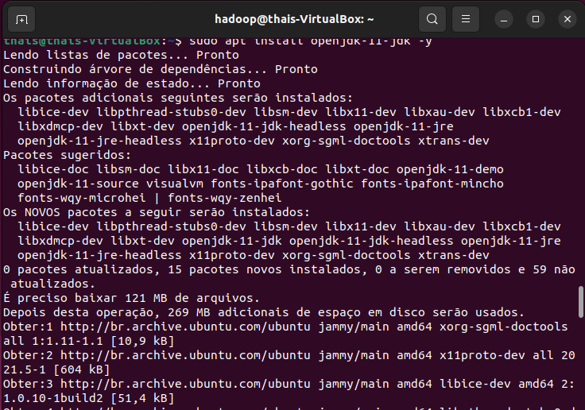
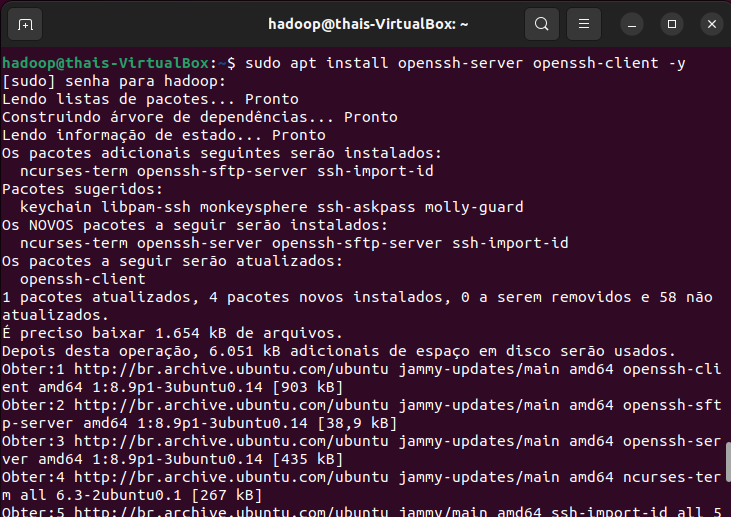
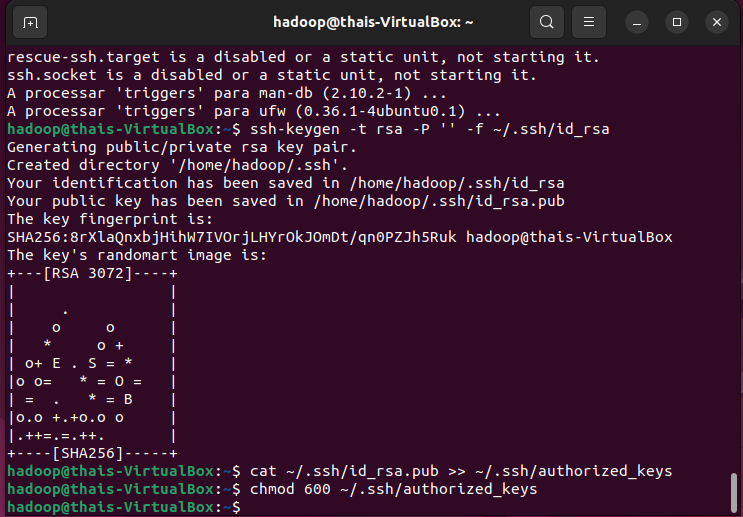
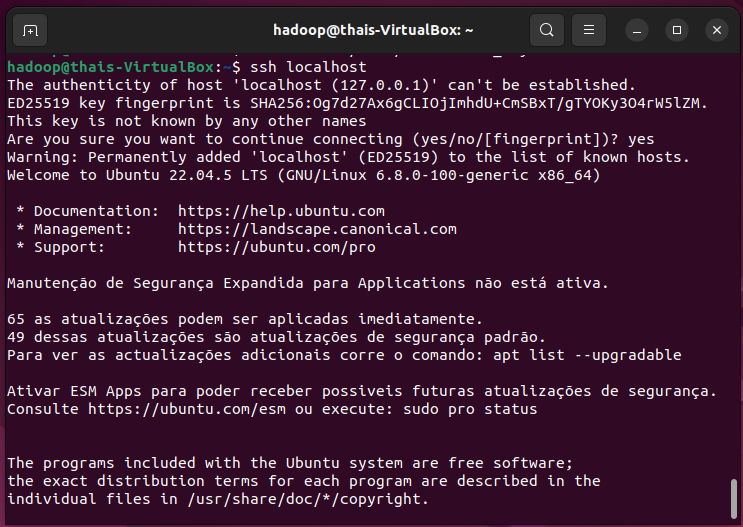
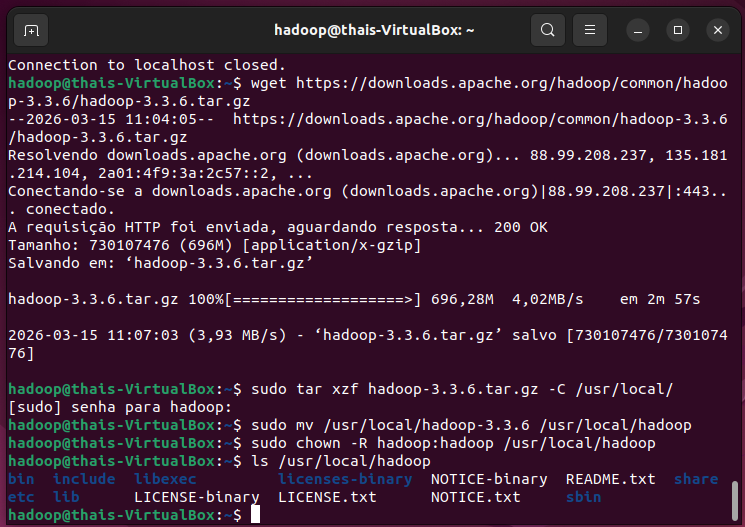
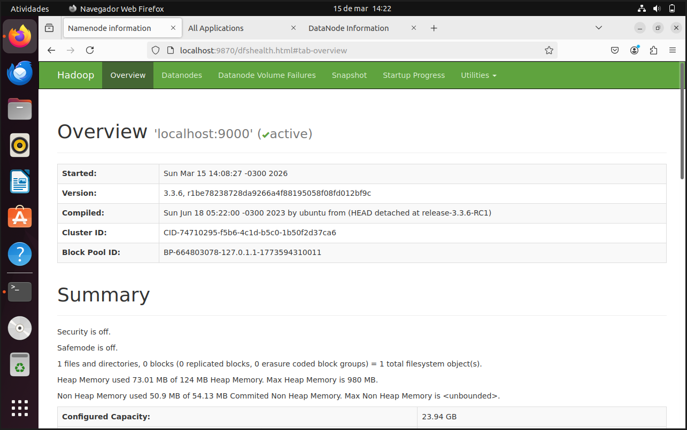
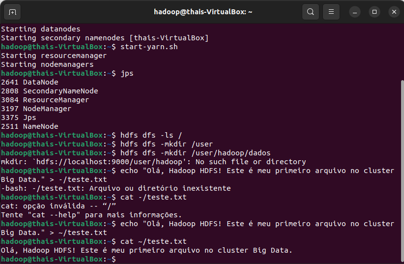
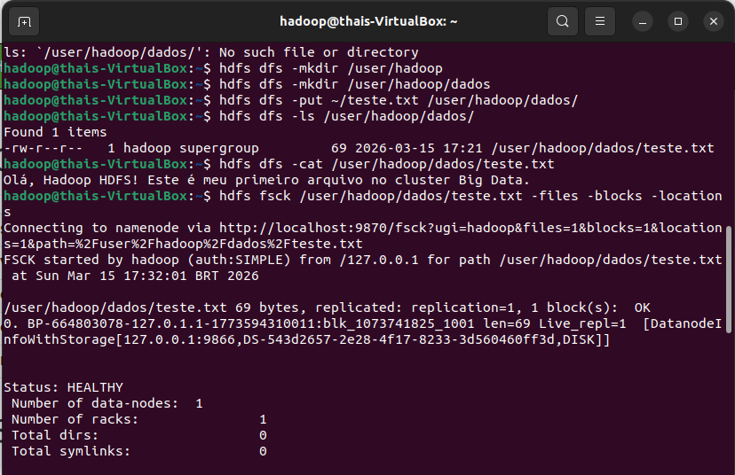
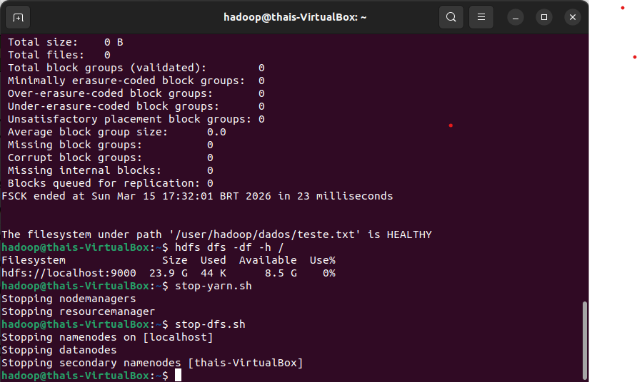

# 🐘 Missão Hadoop HDFS: Cluster Pseudo-Distribuído

Este repositório documenta a instalação, configuração e operação básica de um cluster Hadoop HDFS em modo pseudo-distribuído no Ubuntu 22.04. O objetivo desta prática é implementar ferramentas que transformam sistemas operacionais em sistemas de armazenamento de grandes massas de dados.

## 🛠️ Etapas de Preparação (Missões 1 a 6)

Antes de operar o HDFS, a infraestrutura do cluster foi preparada seguindo os seguintes passos:

### 1. Preparação do Sistema
Instalação do OpenJDK 11 e criação do usuário dedicado `hadoop` para rodar o cluster de forma segura.

### 2. Configuração SSH
Instalação do servidor e cliente SSH, geração de chaves RSA e configuração de acesso *passwordless* ao `localhost` para permitir que o Hadoop gerencie os nós de forma automática.

### 3. Instalação do Hadoop
Download do Apache Hadoop 3.3.6 diretamente do repositório oficial, extração para `/usr/local/` e ajuste de permissões de diretório para o usuário `hadoop`.

### 4. Inicialização e Validação
Após configurar as variáveis de ambiente e os arquivos XML do Hadoop (`core-site.xml`, `hdfs-site.xml`, etc.), o NameNode foi formatado e os daemons do DFS e YARN foram iniciados. O funcionamento foi validado pela interface web.

---

## 🚀 Operações Básicas no HDFS (Missão 7)

Com o cluster rodando, validamos os processos Java ativos com o comando `jps` (NameNode, DataNode, SecondaryNameNode, ResourceManager e NodeManager) e executamos os comandos essenciais para interagir com o sistema de arquivos distribuído. 

Abaixo está o log detalhado das operações realizadas:

### 1. Criação de Diretórios e Preparação de Arquivo
Validamos os processos com `jps` e criamos uma estrutura de diretórios para organizar os dados. Um arquivo de texto local (`teste.txt`) foi gerado para envio.

### 2. Envio, Leitura e Diagnóstico (FSCK)
O arquivo foi transferido para o HDFS usando o comando `-put`. Em seguida, confirmamos o envio com `-ls` e lemos o conteúdo diretamente do cluster com `-cat`. 
O comando `fsck` foi utilizado para verificar o status de saúde do arquivo, exibindo a divisão de blocos e em quais DataNodes ele está armazenado.

### 3. Verificação de Espaço e Desligamento
O relatório do `fsck` retornou o status `HEALTHY`. Monitoramos a capacidade de armazenamento do HDFS com `-df -h` e encerramos os serviços do YARN e HDFS de forma segura (`stop-yarn.sh` e `stop-dfs.sh`).

