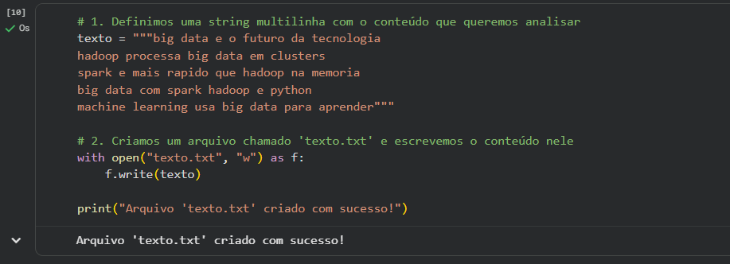
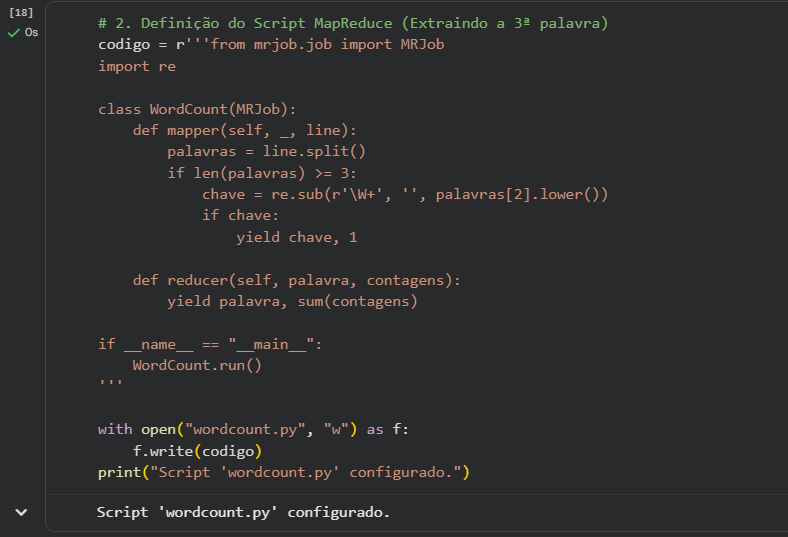
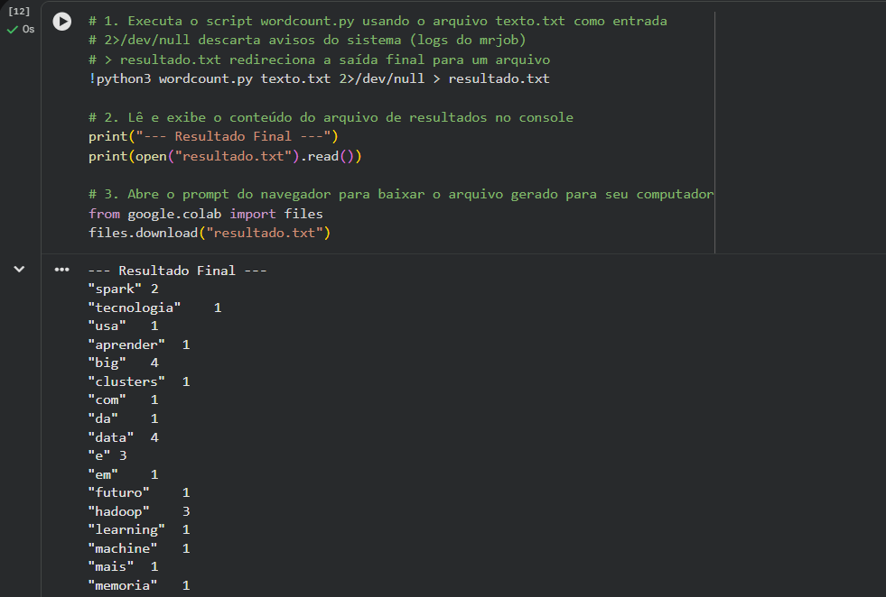
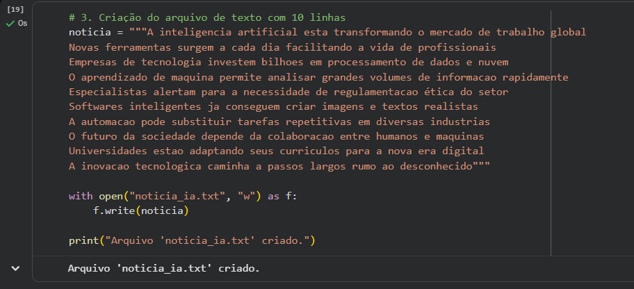
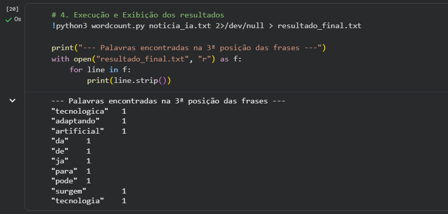
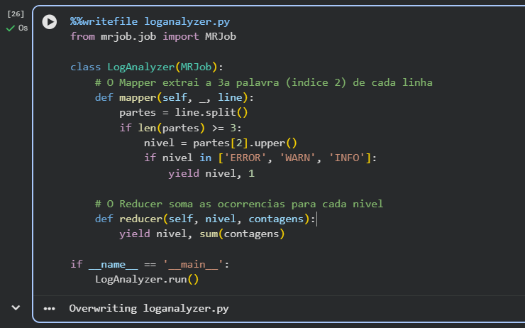
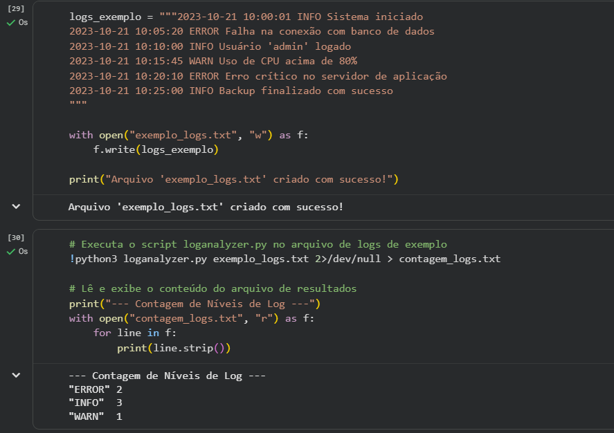

# MapReduce - Programação Distribuída

## 📚 Sobre a Atividade
Este repositório documenta a prática com **MapReduce**, um modelo de programação criado pelo Google em 2004 para processar grandes volumes de dados em paralelo em centenas de máquinas. 

O pipeline completo do MapReduce segue estas etapas:
1. **Input:** O HDFS divide o arquivo em blocos e distribui para os nós.
2. **Map:** Cada Mapper processa um bloco e emite pares (chave, valor).
3. **Shuffle & Sort:** Agrupa valores com a mesma chave de forma automática.
4. **Reduce:** Processa cada grupo e gera o resultado final.
5. **Output:** Resultado salvo no HDFS ou disco.

---

## ✅ Respostas dos Quizzes

* **Quiz 1 - Qual fase é responsável por agrupar todos os valores com a mesma chave antes de enviá-los ao Reducer?**
  * **Resposta:** Shuffle & Sort - fase intermediária automática do framework.
* **Quiz 2 - O Mapper recebe a linha "hadoop spark hadoop". Quantas vezes ele emite a chave "hadoop"?**
  * **Resposta:** 2 vezes - emite ("hadoop", 1) para CADA ocorrência encontrada.
* **Quiz 3 - No arquivo `texto.txt` com 5 linhas, qual a contagem da palavra "big" após executar o WordCount?**
  * **Resposta:** 4 - aparece nas linhas 1, 2, 4 e 5 ("big data" em quatro linhas).

---

## 🚀 Execução Prática (Google Colab)

Utilizamos Python com a biblioteca `mrjob` para implementar a lógica de mapeamento e redução. O script foi adaptado para extrair palavras específicas aplicando a lógica de manipulação de índices por `split()`.

### 1. Criação do Arquivo de Texto Base
Definimos uma string multilinhas e criamos o arquivo `texto.txt` inicial.

### 2. Definição do Script MapReduce
Criação do script `wordcount.py`, configurado para ler as linhas, dividi-las e extrair a chave localizada no índice 2 de cada linha válida.

### 3. Teste Inicial do Script
Execução do script gerado para verificar o processamento e as chaves extraídas pelo Mapper.

![Execução do script MapReduce]imagens/(3.png)

### 4. Execução Completa e Redirecionamento
Execução do WordCount base usando o arquivo `texto.txt`. A saída foi limpa de logs internos com `2>/dev/null` e redirecionada para `resultado.txt`.

---

## 🎯 Missão 1: Texto Real (10+ Linhas)

A missão consistia em usar o código para processar um arquivo com pelo menos 10 linhas de texto.

### Criação do Arquivo
Criação do arquivo `noticia_ia.txt` com um texto autoral de 10 linhas sobre os impactos da Inteligência Artificial.

### Execução e Resultado Final
Processamento do arquivo `noticia_ia.txt` exibindo as palavras encontradas na 3ª posição de cada frase do texto.

---

## 🎯 Missão 2: LogAnalyzer

[cite_start]A segunda missão exigia a criação de um script para ler um arquivo de logs de sistema e contar quantas linhas correspondiam a cada nível de log (ERROR, WARN, INFO) [cite: 258-259].

### Definição do Script `loganalyzer.py`
[cite_start]O Mapper foi configurado para usar o `.split()` e extrair especificamente a 3ª palavra de cada linha (índice 2), que contém o nível do log[cite: 261].

### Execução com Arquivo de Teste
Criamos um arquivo de texto simulando logs de servidor (`exemplo_logs.txt`) e executamos o job MapReduce. O Reducer somou corretamente as ocorrências, retornando o agrupamento final dos níveis de log.

